  
  
  
  
  

## About me

- I build developer tools, local infrastructure, desktop software, and games.
- I currently collaborate with [Selleo](https://selleo.com/) on software products.
- I enjoy logic, probability, pixel art, RPGs, films, and animation.
- I like understanding how things work before deciding how to solve a problem.

## Where it started

Pokémon Ruby and RPG Maker XP pulled me into programming. "Maxie" is the name that stayed with me online.
